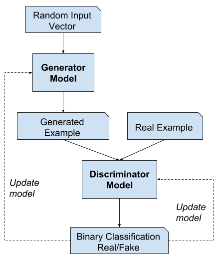
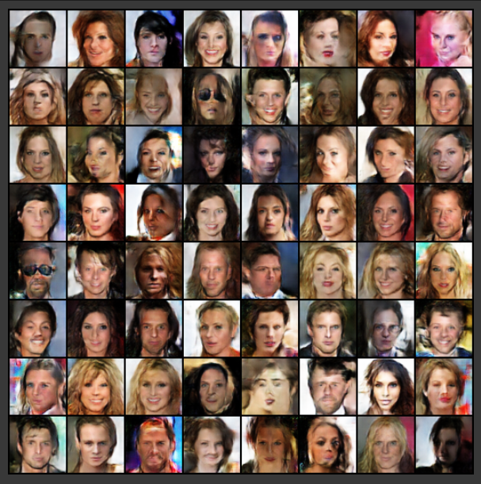
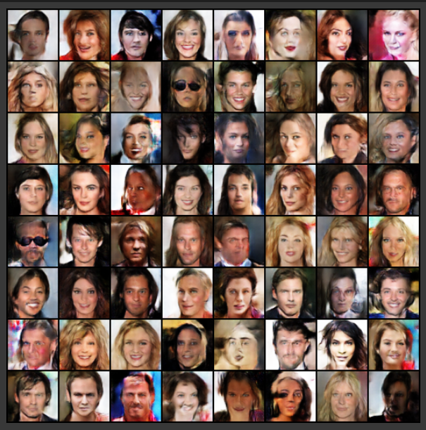
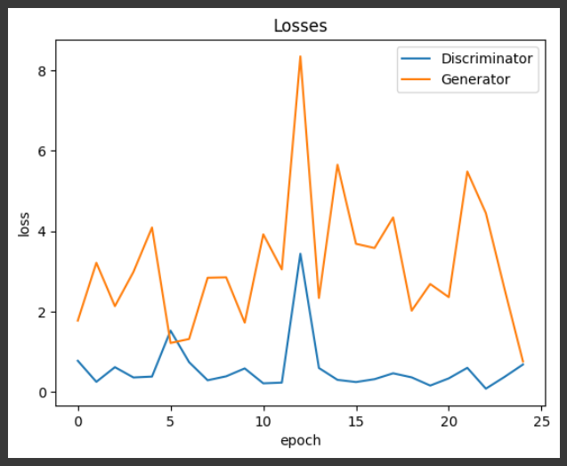
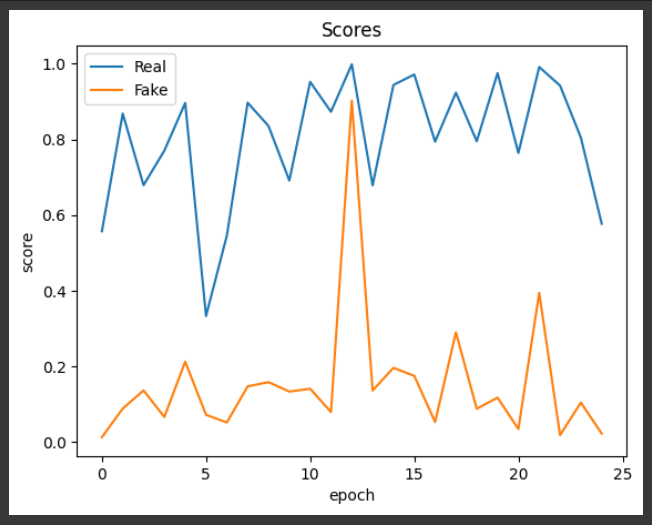

<H1 ALIGN=CENTER> GENERATIVE ADVERSARIAL NETWORKS (GANs) </H1>
Creating a Generative Adversarial Network (GAN) involves training a generator and a discriminator simultaneously, where the generator learns to generate realistic data while the discriminator learns to distinguish between real and generated data.

## ABOUT
This project is focused on developing a GAN-based deepfake detection system. The primary goal is to create a tool capable of identifying and distinguishing between real and AI-generated (deepfake) content, specifically in videos or images. With the rise of manipulated media, deepfake detection has become crucial for media integrity, security, and user trust. GANs (Generative Adversarial Networks) play a dual role in this project: while they’re commonly used to generate realistic fake images and videos, their underlying mechanics can also aid in detecting such synthetic content.

The project involves training a model to recognize subtle inconsistencies that often appear in deepfake media, such as unnatural artifacts, irregular facial expressions, or abnormal pixel patterns. The system's workflow typically involves preprocessing input videos or images, feeding them into the detection model, and outputting a probability score or classification indicating the likelihood of a deepfake.

The end result is a web-based application where users can upload videos for deepfake detection, aimed at empowering individuals, media companies, and organizations to protect themselves from deceptive content.

## FEATURES

### Generative Capabilities: 
GANs can generate high-quality synthetic data samples that resemble real data, such as images, text, and music.

### Unsupervised Learning: 
GANs operate without explicit labels during training, making them suitable for unsupervised learning tasks like data generation and anomaly detection.

### Diversity in Output:
GANs can produce diverse outputs by exploring different regions of the data distribution, enabling creativity and variability in generated content.

### Transfer Learning: 
Pre-trained GAN models can be fine-tuned or used as feature extractors for downstream tasks, leveraging the learned representations for improved performance.

### Robustness and Stability: 
Advances in GAN architectures and training techniques have improved stability and convergence, addressing challenges such as mode collapse and training instability.

## REQUIRMENTS
### Hardware Resources: 
GAN training typically requires powerful hardware such as GPUs or TPUs due to the computational intensity of training deep neural networks.

### Software Frameworks: 
Utilize deep learning frameworks like TensorFlow, PyTorch, or Keras for implementing GAN architectures and conducting training experiments.

### Dataset Preparation: 
Gather and preprocess a high-quality dataset relevant to the desired application (e.g., images, text, audio) to train the GAN effectively.

### GAN Architecture Selection: 
Choose an appropriate GAN architecture (e.g., DCGAN, WGAN, CycleGAN) based on the specific task and data characteristics to achieve desired results.

### Loss Function Design: 
Define suitable loss functions for the generator and discriminator to guide the training process and encourage convergence towards generating realistic data.

### Hyperparameter Tuning: 
Fine-tune hyperparameters such as learning rates, batch sizes, and regularization techniques to optimize GAN performance and stability during training.

### Training Strategy: 
Implement training strategies like mini-batch training, gradient clipping, and learning rate scheduling to mitigate issues like mode collapse and improve overall training stability.

## SYSTEM ARCHITECTURE

## OUTPUT
### Output1 - Generated Image

### Output2 - Genertaed Image 2

### Output3 - losses

### Output4 - Scores

## RESULTS AND IMPACT
### High-Quality Data Generation: 
GANs can produce synthetic data samples that closely resemble real data, which can be beneficial for applications like image synthesis, text generation, and data augmentation.Improved Creativity and Innovation: GANs enable the generation of diverse and novel outputs, fostering creativity in fields such as art, design, and content creation. Enhanced Anomaly Detection: GANs can learn the underlying data distribution and detect anomalies or outliers that deviate significantly from normal data patterns, aiding in anomaly detection and fraud prevention systems.

### Advanced Machine Learning Applications:
The advancements in GAN technology have led to breakthroughs in various machine learning tasks, including style transfer, image-to-image translation, and semi-supervised learning, expanding the capabilities of AI systems in diverse domains.

## ARTICLES PUBLISHED / REFERENCES
1. Goodfellow, I., Pouget-Abadie, J., Mirza, M., Xu, B., Warde-Farley, D., Ozair, S., ... & Bengio, Y. (2014). "Generative Adversarial Nets." In Advances in Neural Information Processing Systems (pp. 2672-2680).

2. Radford, A., Metz, L., & Chintala, S. (2016). "Unsupervised Representation Learning with Deep Convolutional Generative Adversarial Networks." In International Conference on Learning Representations (ICLR).
